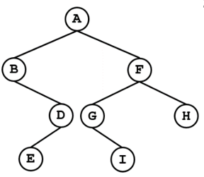

<<<<<<< HEAD
P0670:打印文本缩进二叉树  

总时间限制: 1000ms 内存限制: 65536kB  
描述  
文本缩进二叉树就是由若干行文本来表示的一棵二叉树。其定义如下:   

1) 若一行由若干个制表符("\t")和一个字母构成，则该行表示一个二叉树的结点。该结点的层次就是制表符的数量（根是0层）  

2) 每个结点的父结点，就是它上方，离它最近的，比它往左偏移了一个制表符的那个结点。没有父结点的结点，是树根。  

3) 如果一个结点的左子树为空但右子树不为空，则在其下面的一行用一个向右多缩进了一个制表符的'*'表示其有空的左子树，然后再表示右子树。若右子树为空，则右子树无须表示。若右子树不为空，则表示完左子树后再表示右子树。若左右子树都为空，则左右子树都不需要表示。  

给定一个文本缩进二叉树的中序、后序遍历序列，请输出该文本二叉树。  


输入  
2行。  
第1行是中序遍历序列  
第2行是后序遍历序列  
二叉树不超过100个结点，且结点的字母不会重复。  
输出  
该二叉树的文本缩进表示形式  
样例输入  
####
    BEDAGIFH
    EDBIGHFA
样例输出
####
    A
        B
            *
            D
                E
        F
            G
                *
                I
            H
=======
# P0670:打印文本缩进二叉树
------

总时间限制: 1000ms 内存限制: 65536kB

### 描述

文本缩进二叉树就是由若干行文本来表示的一棵二叉树。其定义如下: 

1) 若一行由若干个制表符("\t")和一个字母构成，则该行表示一个二叉树的结点。该结点的层次就是制表符的数量（根是0层）

2) 每个结点的父结点，就是它上方，离它最近的，比它往左偏移了一个制表符的那个结点。没有父结点的结点，是树根。

3) 如果一个结点的左子树为空但右子树不为空，则在其下面的一行用一个向右多缩进了一个制表符的'*'表示其有空的左子树，然后再表示右子树。若右子树为空，则右子树无须表示。若右子树不为空，则表示完左子树后再表示右子树。若左右子树都为空，则左右子树都不需要表示。

给定一个文本缩进二叉树的中序、后序遍历序列，请输出该文本二叉树。

样例输入的二叉树如下图


### 输入

2行。
第1行是中序遍历序列
第2行是后序遍历序列
二叉树不超过100个结点，且结点的字母不会重复。

### 输出

该二叉树的文本缩进表示形式<br>

### 样例输入
```python
BEDAGIFH
EDBIGHFA
```
### 样例输出
```python
A
	B
		*
		D
			E
	F
		G
			*
			I
		H
```

>>>>>>> upstream/main
